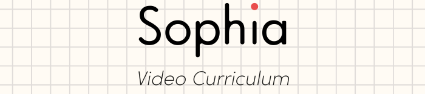

This repository is a **video curriculum for teaching mathematics with computer-generated short videos**.
The videos are rendered with [Manim](https://www.manim.community).
Currently, this repository uses [Elevenlabs](https://elevenlabs.io) for ultra realistic voice synthesis. 

**TL;DR:** Each of our short explanatory videos is generated from a simple Python script. It's easy to adapt them or personalize them for your personal requirements!

## Examples / The current curriculum
The entire structured curriculum with all videos can be found here: [Sophia Math Curriculum](https://opensource.sophiaedulabs.com/syllabus).
The existing content is primarily created and funded by [our Swiss-based startup Sophia Edu Labs](https://sophiaedulabs.com), which builds on videos in this repository to create a personalized learning experience for students.

## ⚡️ Quick Start
Make sure you have [Docker Desktop](https://www.docker.com/products/docker-desktop/) installed.
1. Clone the repository:
`git clone https://github.com/Sophia-Edu-Labs/sophia-math.git`
2. Open the cloned repository in [VSCode](https://code.visualstudio.com), e.g. via the command line: `code ./sophia-math`. 
3. Make sure that you have installed the [Dev Containers](https://marketplace.visualstudio.com/items?itemName=ms-vscode-remote.remote-containers) Extension.
3. Open the Devcontainer by selecting **Remote-Containers: Reopen in Container** (press <kbd>F1</kbd> to open the Command Palette).
4. While the container builds, create an account at [https://elevenlabs.io](https://elevenlabs.io) and copy your API key from your profile.
5. As soon as the container is ready, create a new file `.env` at the workspace root (see the [Example File](./.env.example) for the format) and save your Elevenlabs API key there.

### 🖼️ Render a video
1. Select a file from the [scenes](./scenes) folder, e.g. the subchapter:  
[*Introduction to Functions* ➡️ *Terms of Functions*](./scenes/Func/Func_1:%20Intro%20Functions/Func_1_1.py).
2. Open VSCode's Command Palette (<kbd>F1</kbd>) and select **Manim: Runs a Sideview**.
3. Select a particular video that you would like to render. Like `Func_1_2_I_1`. Press <kbd>Enter</kbd> and wait to see the rendered video in the sideview of VSCode.
4. Optional: Make changes to the corresponding manim scene and rerun the command to render the video (i.e. go back to *Step 2*). 

It's that easy. Now you know how to create your customized educational short video explaining math. 🎉 You can even add some new ones yourself ✨

### :octocat: Alternative: GitHub Codespaces
Another way to get started quickly is to use GitHub Codespaces, if you have access to it. 
1. Click on the green button **Code** and select **Open with Codespaces**.
2. While the Codespace is building, create an account at [https://elevenlabs.io](https://elevenlabs.io) and copy your API key from your profile.
3. Wait until the Codespace is ready.
4. Create a new file `.env` and save your Elevenlabs API key there.

⚠ Note: Since video development involves playing videos inside the code space, you should use Chrome as your browser to avoid sound issues in your browser!

## 🤔 Why this project?
We (i.e. two students from *ETH Zurich 🇨🇭* and our startup [Sophia Edu Labs](https://sophiaedulabs.com)) came up with the idea of creating educational short videos from code because we think they are the perfect format for a 21st century personalized learning experience.

Education shouldn't be owned by anyone. It should be accessible to everyone. That's why we are very proud to make this work open source. We hope it can help more people understand the amazing world of mathematics, or help teachers or parents improve the way they teach math.

Here are three examples of how our open source curriculum could be used:
- **In the classroom:** Are you a teacher and want to improve your teaching? You can use our short videos as a basis for creating your own videos, just as you need them to meet the needs of your students. Or you can even give your students the task of creating their own TikTok-like explanations. We think this is pretty interesting, a very creative task and could connect writing code with learning math. 🏫
- **In a private math lessons:** Are you a private math tutor who teaches students in a concentrated environment? If you are familiar with Python, you can make your math lessons much more interactive and engaging. With the nice side effect of spending less time preparing your lessons, but writing pythonic code. And at the same time you create a better learning experience for your students! ✨ 
- **For your own learning:** Are you a student who knows how to program in Python and you're bored by the traditional way of learning math? You can use this repository to create your own videos for your own learning. And it's true: You don't fully understand things until you're able to explain them to others. And afterwards, you can share your creations with your friends, or upload them to TikTok. This way, you help your friends understand math better (when your math class is boring), or you can just use it to show off your programming skills. 🙃
- **For research:** Are you doing research in the field of educational technology, educational data science or learning science?
Then this may be a great solution for your research projects. You can easily change many parameters of the videos, it has never been so easy to create different versions of the same video to test different approaches. And most importantly, it's dead easy to get a lot of statistics out of such videos. And further, there are also many research questions that arise just from this format of learning with short videos. Feel free to advance the science in this field! 🧪

Our ambitious vision is making personalized education accesible to everyone. The world has so many brilliant minds, and they all deserve to be educated well.

And You are cordially invited to join us on this journey! 🤝

## 🧑‍💻 Contributions
Open a Pull Request if you have created a new video or have edits for an existing one. We are happy to merge it into the main branch.

### Does ✅ and ❌ Don'ts 
With this repository we are trying to provide ressources to learn about as many topics within mathematics as possible.

- **Please do not use this repository for any purpose other than mathematical education.** We are not responsible for any other derived use of the code or generated videos from this repository. We will not accept pull requests that are not related to mathematical education.
- Do use only fun examples and explanations that have no political implications. Do not use the material to propagate political or world-views.
- Be as inclusive as possible and try to avoid reproducing stereotypes and biases. Ask yourself if an explanatory video disproportionately appeals to a particular social group. If so, please try to add other versions with other explanatory approaches that appeal to other social groups as well. If you are unsure or if you have discovered existing problems, please open an issue!

### 🚀 Where you could start
We think it would be especially fruitful to work on one of the following things (it's what we're working on ourselves!). But for now, we'll have to limit ourselves to a subset of what we think is possible for this project in the near future):: 
- [ ] Add more topics and realistic examples + more motivational videos that explain why a given topic is particularly interesting and worth learning.
- [ ] Add more languages (currently we are working on German and English)
- [ ] Add more variations and different approaches to explaining the topics
- [ ] Because it's fun: experiment with other voices, maybe also based on elevenlabs. Imagine Taylor Swift explaining math to you. Or Barack Obama will start explaining math with short videos. WOULDN'T THAT BE COOL? 😏
- [ ] Use this repository as the basis for more educational content with a very strong regional focus. We know that there are some best practices for explaining mathematics in general. But each language and state, location and school has its own requirements and circumstances.
- [ ] Open an issue if you find a bug or have a topic request with ideas on how to present the proposed topic in several structured short videos.
- [ ] Feedback: watch the videos and let us know what you think and where we can improve. Open an issue for this purpose.

# 🤨 Questions? Problems? Ideas? 💡
Reach out to us! 

We will be happy to help you! And answer all your questions!
You can open an issue in this repo, or if you want to contact us directly, please visit our [open source website](https://opensource.sophiaedulabs.com)! We'd like to hear from you! Or even invite you for a coffee – in person (if you visit us in Switzerland) or virtually.

# License
Copyright (c) Gero Embser, Friedrich Wicke. All rights reserved.

Licensed under the [GNU General Public License v3.0](./LICENSE).

## Remarks

The content you create based on this repository should be freely accessible and "owned" by all. Therefore, it is important for us to share this content, get valuable feedback and improve it, and try to keep it up to date with the latest educational research. We keep the content open source and encourage you to contribute and enhance it. That's why we've chosen a [license](./LICENSE) that ensures any changes or additions to our video curriculum will be made publicly available. Feel free to use it for your classroom or your own commercial project. That's fine too. As long as we agree that the world needs more education. And you share your work. The code must be made publicly available under the terms of our license, but it's up to you how you share the videos you generate. However, we would greatly appreciate it if you refer to this project.
We know we can't have rights to the math itself (and we don't want to!). But if you use the content and the way it is presented here for your own products, we would appreciate it if you not only refer to this project, but try to make it as open source and as accessible as possible. 
In fact, we would really appreciate it! 😇
